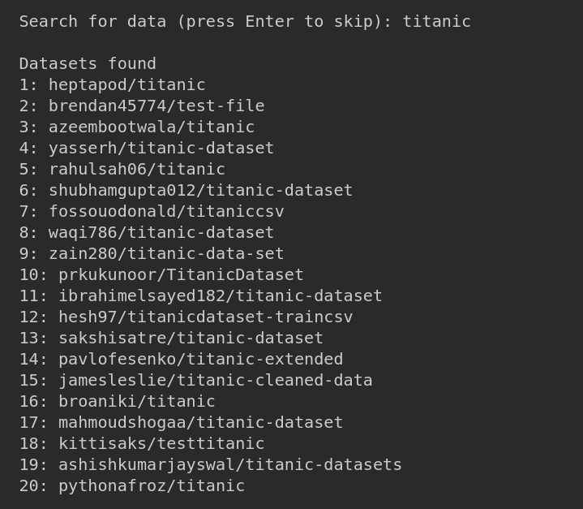
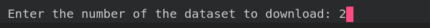
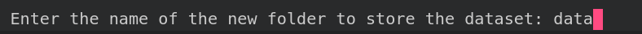
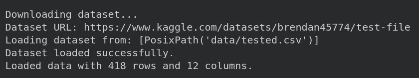
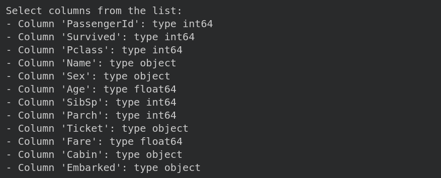
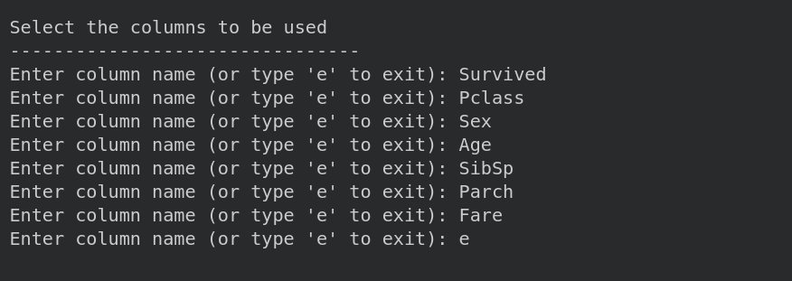
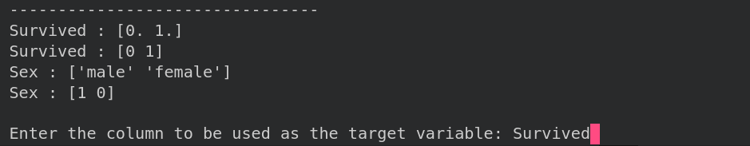
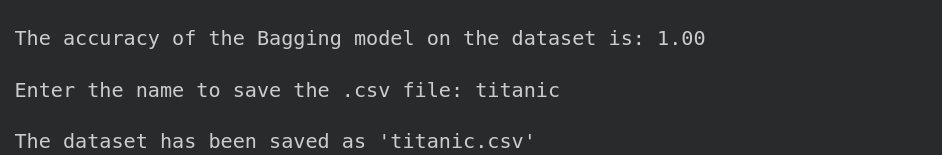
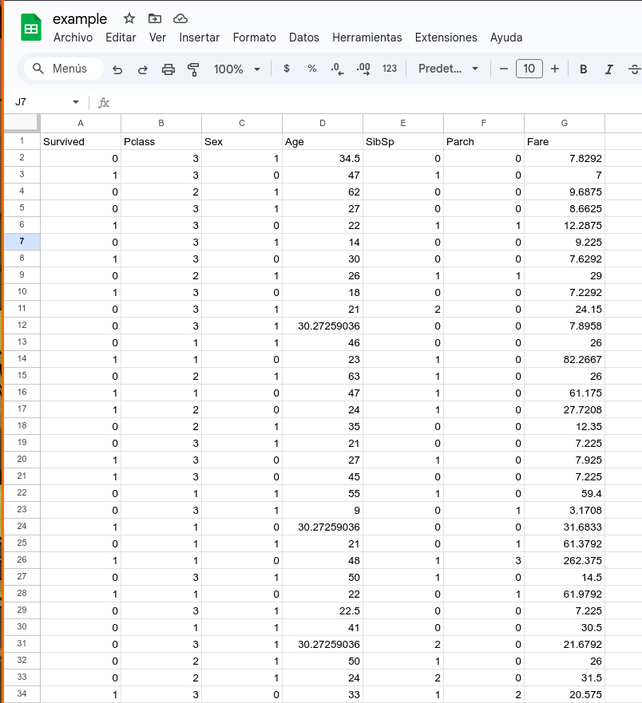
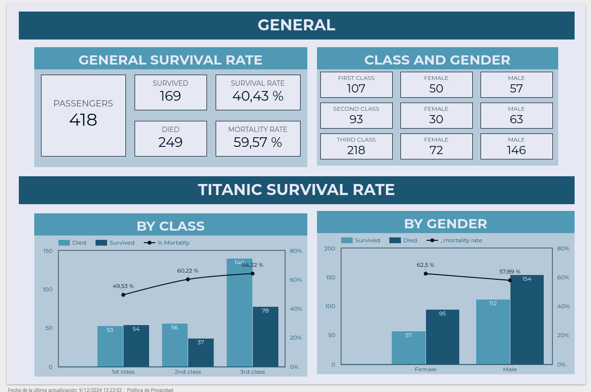

# bagging-with-kaggle

## General Machine Learning Pipeline with Bagging Classifier

This project implements a machine learning pipeline to analyze and predict survival on the Titanic dataset. It leverages a Bagging Classifier with decision trees to enhance model robustness. The project includes data preprocessing, model training, evaluation, and saving the results.

## Features

- Interactive column selection for preprocessing.
- Handles missing values and encodes categorical variables.
- Implements Bagging Classifier with decision trees.
- Exports the processed dataset to .csv and Google Sheets.

## Prerequisites

Before running the code, ensure you have the following:

- Python 3.8+
- Kaggle API credentials for downloading the dataset.
- Necessary Python libraries (see requirements.txt).
- Access to Google Sheets API (if using the csv_to_sheets function).

## Instalation

### 1. Clone this repository

``` 
git clone https://github.com/<your-username>/<repository-name>.git 
cd <repository-name>
```

### 2. Intall required Python libraries
```
pip install -r requirements.txt
```

### 3. Set up the Kaggle API:
- Download your kaggle.json file from [Kaggle API](https://www.kaggle.com/docs/api).
- Place it in the appropriate directory (~/.kaggle on Unix or %USERPROFILE%\.kaggle on Windows).

### 4. Configure Google Sheets API:
- Follow [Google Sheets API documentation](https://developers.google.com/sheets/api/guides/concepts) to set up credentials.
- Place the credentials in the project directory.

## Usage

### 1. Run the main script:

```
python bagging.py
```

### Fetch a dataset from Kaggle:

- When prompted, enter a search term to find datasets on Kaggle (e.g., "Titanic", "Housing Prices").
- A list of datasets matching your search will be displayed. For example:

<br>



- Enter the number corresponding to the dataset you want to download.

<br>



### 3. Specify a folder to save the dataset:

- Enter a name for a new folder where the dataset will be downloaded and unzipped.

<br>



### 4. Dataset selection:

- If the downloaded dataset contains multiple *.csv files*, the script will load the first *.csv file* by default.
- The dataset is automatically loaded into a *Pandas DataFrame.*

<br>



### 5. Follow the prompts in bagging.py:

- Interactively select columns for analysis.
- Handle missing values automatically.
- Specify the target column (dependent variable).

<br>




### 6. Model Training and Evaluation:

- The script splits the data into training and testing sets.
- Trains a Bagging Classifier using decision trees.
- Accuracy on the test set is displayed in the console.
<br>



### 7. Save Results:

- Processed data is saved as a *.csv file* in the *save/* directory.



<br>
- Optionally, upload the dataset to Google Sheets using the *google_sheets_utils.py* script.
<br>


<br>



### 8. Create a Looker Studio with googlesheets:

- Looker Studio: [Example - Titanic Survival Rate](https://lookerstudio.google.com/reporting/9296e179-5f35-42b4-92d8-d36b4dee1999/page/ZgkYE)
<br>



## Acknowledgments

- Kaggle datasets: [Kaggle Datasets.](https://www.kaggle.com/datasets)
- Scikit-learn: [Scikit-learn Documentation.](https://scikit-learn.org/stable/)
- Pandas: [Pandas Documentation.](https://pandas.pydata.org/docs/)
- Curses: [Curses Documentation.](https://docs.python.org/3/library/curses.html)
<br>